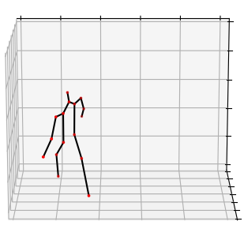

# SURREALvols

**Paper:** VolNet: Estimating Human Body Part Volumes from a Single RGB Image

<a href="https://arxiv.org/abs/2008.XXX"></a>

The files in this repository add information about body part volumes and the person's body height to the SURREAL dataset. 

Example:

|  |  |  |  |
|-|-|-|-|

Body Height: 169 cm 

| Body Part       | Volume [dm³] |
| --------------- | -------------:|
| head            |  7.53         |
| torso           | 52.56         |
| left upper arm  |  2.28         |
| left fore arm   |  1.60         |
| left hand       |  0.74         |
| right upper arm |  2.63         |
| right fore arm  |  1.70         |
| right hand      |  0.73         |
| left up leg     |  7.11         |
| left lower leg  |  3.43         |
| left foot       |  1.88         |
| right up leg    |  7.05         |
| right leg       |  3.45         |
| right foot      |  1.83         |
| **total**           | **94.57**         |

## Usage
### Prepare SURREAL
You can either generate your own data or download the SURREAL dataset ([website](https://www.di.ens.fr/willow/research/surreal/data/), [github](https://github.com/gulvarol/surreal)). The `_info.mat` files are the only files used by this script, so there's no need to download or generate any other modality for this script.


### Clone Repository
```
git clone https://github.com/fleinen/SURREALvols.git 
```

### Download SMPL
Register at [smpl.is.tue.mpg.de](https://smpl.is.tue.mpg.de/) and [download version 1.0.0 for Python 2.7 (10 shape PCs)](https://psfiles.is.tuebingen.mpg.de/downloads/smpl/SMPL_python_v-1-0-0-zip). Unpack the file and copy the folder `smpl` to the root of this repository.The folder structure should look like this:

```
+-- smpl
|   +-- models
|   +-- smpl_webuser
|   +-- __init__.py
+-- templates
|   +-- 01_head.npy
|   +-- 02_torso.npy
|   +-- 03_arm_left.npy
|   +-- ...
+-- add_volumes.py
+-- README.md
+-- requirements.txt
```

### Install dependencies
Unfortunately, this code runs with **Python 2** only. Install all requirements using
```
pip2 install -r requirements.txt
```

### Run
```
python2 add_volumes.py -p path/to/SURREAL_dataset
```
Body part volumes and body heights are added to each `*_info.mat`. 

# Citation
Please cite if you use our code.
```
@Article{leinen21_volnet,
  author      = {Leinen, Fabian and Cozzolino, Vittorio and Sch\"{o}n, Torsten},
  title       = {VolNet: Estimating Human Body Part Volumes from a Single RGB Image},
  year        = {2021}
  note        = {preprint on arXiv at \url{XXX}}
}

```